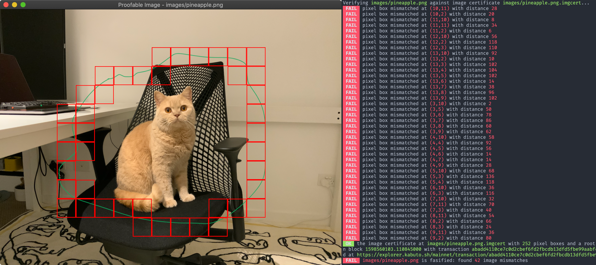

# Proofable Image



ProofableImage builds trust into your image by creating a blockchain certificate for it. The image certificate can not only prove the image as a whole but also prove the pixel boxes and the metadata inside it. For more details, please read through [this Medium post](https://medium.com/@guiguan/build-trust-into-image-with-blockchain-4894c39bde7f).

If you want to prove your file system, please try out the [Proofable CLI](https://docs.proofable.io/cmd/proofable-cli/).

If you want to build trust into your own application, please check out the [Proofable Framework](https://proofable.io/).

## Installation

### Download a prebuilt binary

Following these steps to install the latest prebuilt binary into your current working directory, which is recommended.

#### For macOS and Linux users

Copy, paste and run the following bash command in a [macOS Terminal](https://support.apple.com/en-au/guide/terminal/welcome/mac):

```zsh
bash -c "$(eval "$(if [[ $(command -v curl) ]]; then echo "curl -fsSL"; else echo "wget -qO-"; fi) https://raw.githubusercontent.com/SouthbankSoftware/proofable-image/master/install.sh")"
```

#### For Windows users

Copy, paste and run the following PowerShell command in a [PowerShell prompt](https://docs.microsoft.com/en-us/powershell/scripting/overview?view=powershell-7):

```zsh
& ([ScriptBlock]::Create((New-Object Net.WebClient).DownloadString('https://raw.githubusercontent.com/SouthbankSoftware/proofable-image/master/install.ps1')))
```

### Build your own binary

Install a global binary using `go get`:

```zsh
GO111MODULE=on go get github.com/SouthbankSoftware/proofable-image
```

Or clone this repo and build one:

1. follow the [installation steps](https://gioui.org/doc/install) from Gio to setup the building environment

2. build the binary from source:

   ```zsh
   git clone https://github.com/SouthbankSoftware/proofable-image.git
   cd proofable-image
   make
   ```

## Usage

When using ProofableImage for the first time, you will be asked to sign up/in to ProvenDB with your Google, Github, Facebook, or email account, so a free access token can be generated and saved locally for you. Then ProofableImage can pick up the token to access the Proofable API service in subsequent interactions.

```zsh
./proofable-image path/to/your/image.png
```

This will create an image certificate at `path/to/your/image.png.imgcert` if it doesn't exist yet, and verify the image against it. Then an image viewer will pop up to show any tampering. You can use the option `-imgcert-path` to test the certificate on another image:

```zsh
./proofable-image -imgcert-path=path/to/your/image.png.imgcert path/to/another/image.png
```

For all available options, please use:

```zsh
./proofable-image -h
```

## FAQ

### Linux error: `eglChooseConfig failed: 0x0`

If you encounter this error in Linux, please make sure your graphics driver support OpenGL 3, which is required by the [Gio](https://gioui.org/). For example, the Linux installed in a Parallels Desktop VM only supports OpenGL 2 because of the limitation of the graphics driver provided by Parallels. By disabling the 3D acceleration, the Linux can then use the mesa-based software rendering instead, so OpenGL 3 APIs can be supported and ProofableImage can work as expected.
